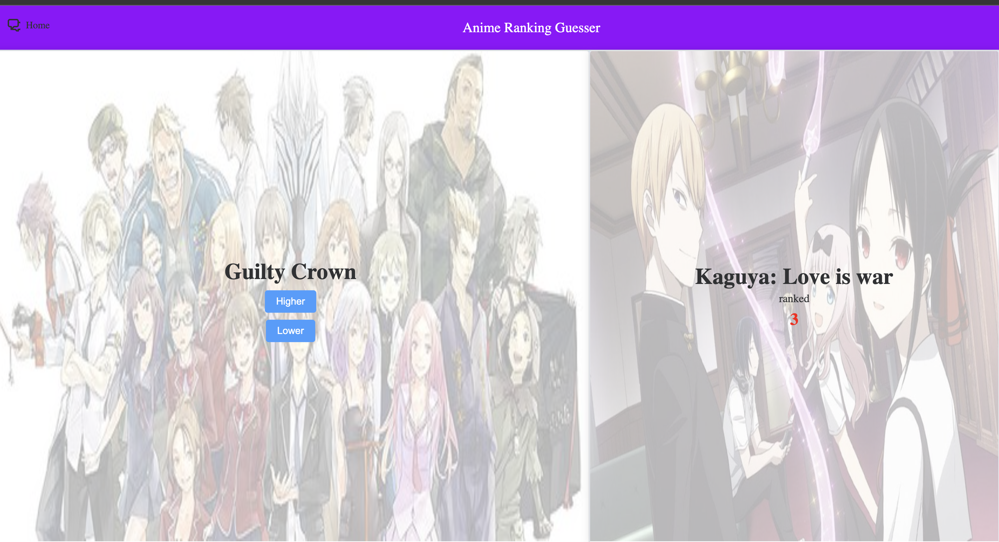

# anime-ranking-guesser

Anime ranking guesser is a side project with the purpose of practicing using Vue3 framework

I get the idea from
- Angela Yu: 100-days-of-code-python (higher-lower game)
- Higher Lower game: https://www.higherlowergame.com/

The rule of the game is simple you have 2 anime images, and you have to guess correctly which anime have ranking higher or lower.



## Project Setup

```sh
npm install
```

### Compile and Hot-Reload for Development

```sh
npm run dev
```

### Type-Check, Compile and Minify for Production

```sh
npm run build
```

### Lint with [ESLint](https://eslint.org/)

```sh
npm run lint
```

## Note
This project is just a skeleton to how to use Vue3. I have some planning to improve it such as:

[ ] Adding docker to aid deployment

[ ] A score board to show highscore as well as status and reset button

[ ] Create a crawler to fetch latest anime data (currently hard coded)

[ ] Improve the UI (this is a makeshift design)
